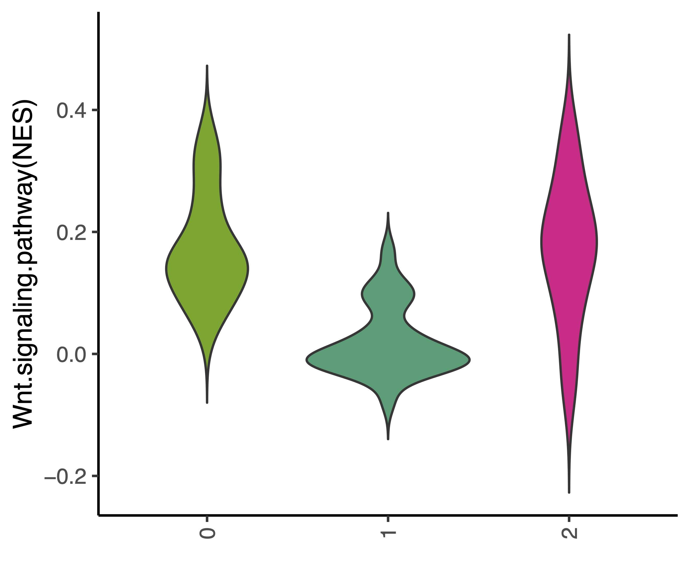
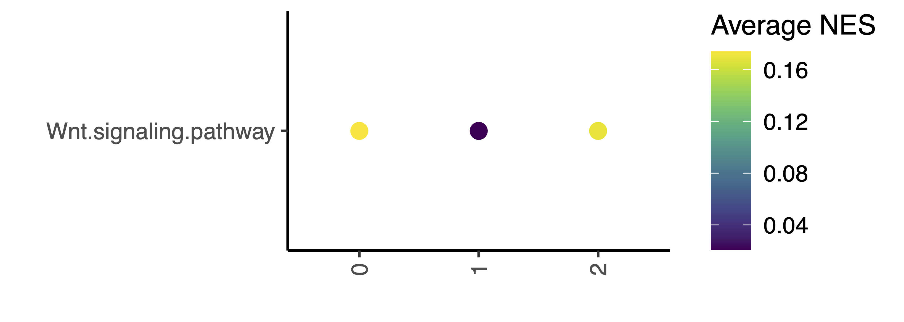
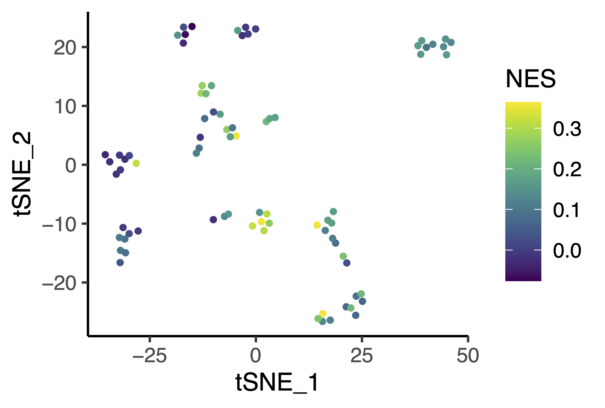
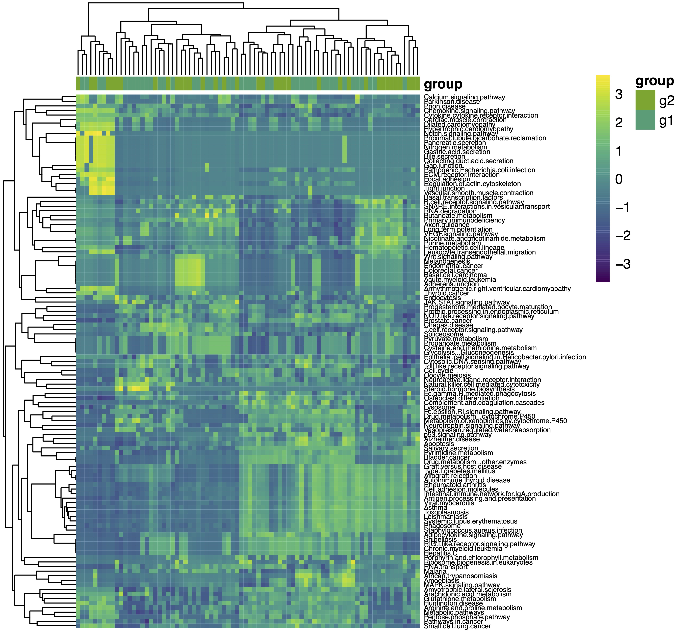

# scGSVA: GSVA for single cell RNA seq analysis. 
# scGSVA [](http://www.repostatus.org/#active)  [](https://github.com/guokai8/scGSVA)  
## Description
_scGSVA_ provides wrap functions to do GSVA analysis for single cell data. And scGSVA includes functions to build annotation for almost all species. scGSVA also provides function to generate figures based on the GSVA results.

_scGSVA_ provides functions to generate annotation data which can be used in the analysis.

_Fixed some issues since there was a bug due to the KEGG annotation changed these days._
_Add batch calculation when the cell population is huge
_Add UCell function within the scgsva function
## Installation
```
library(devtools)
install_github("guokai8/scGSVA")
``` 
## Examples
```{r}
set.seed(123)   
library(scGSVA)   
data(pbmcs)
hsko<-buildAnnot(species="human",keytype="SYMBOL",anntype="KEGG")
res<-scgsva(pbmcs,hsko,method="ssgsea") ## or use UCell
```
```{r}
vlnPlot(res,features="Wnt.signaling.pathway",group_by="groups") ## split.plot = TRUE and split.by
```


```{r}
dotPlot(res,features="Wnt.signaling.pathway",group_by="groups")
```


```{r}
ridgePlot(res,features="Wnt.signaling.pathway",group_by="groups")
```


```{r}
featurePlot(res,features="Wnt.signaling.pathway", reduction="tsne", group_by="groups")
```


```{r}
Heatmap(res,group_by="groups")
```


```{r}
## find significant pathways across groups
findPathway(res,group = "groups")
sigPathway(res, group = "groups")
``` 
```{r}
## extract specific pathways with expression value
genes(res, features = "Wnt.signaling.pathway")
```
## Note
The _scGSVA_ package use the __GSVA__ package to do the GSVA analysis for the single cell data.  The package is still under development.

## Contact information

For any questions please contact guokai8@gmail.com or https://github.com/guokai8/scGSVA/issues

## Recentky update

Try to do multiple p value correction within group wise other than overall. 
