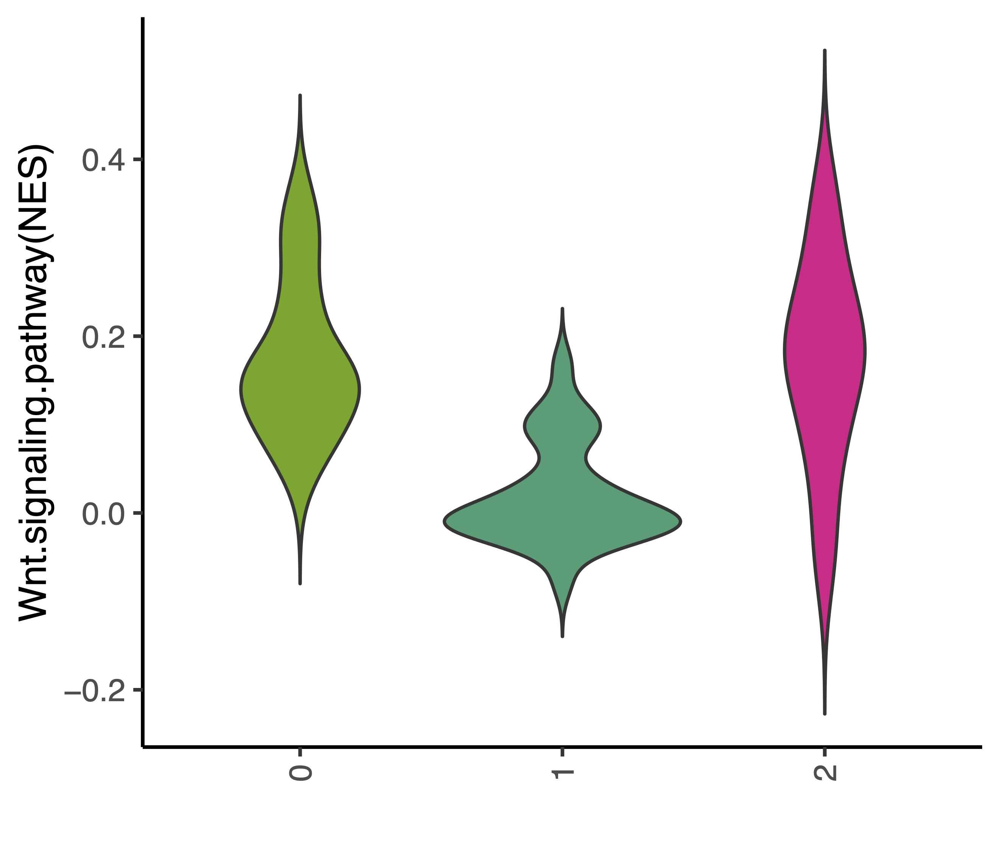
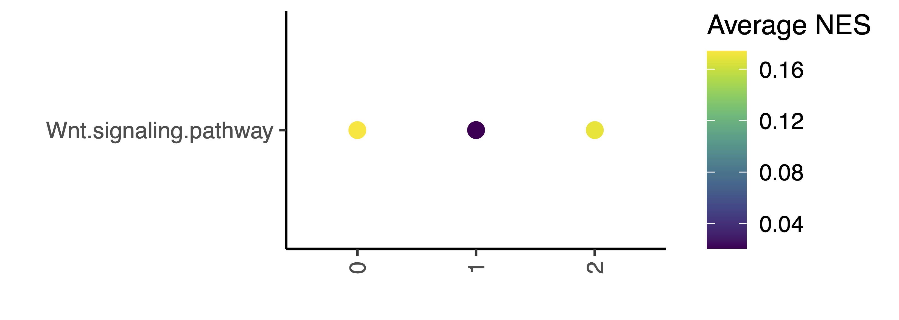
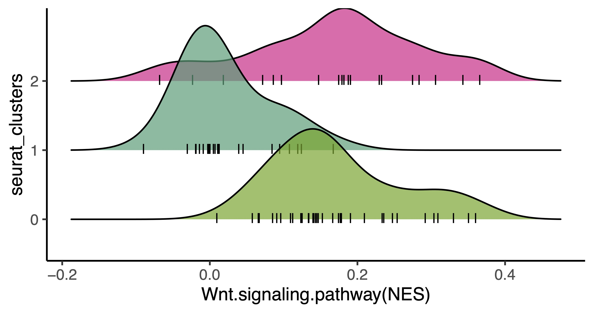
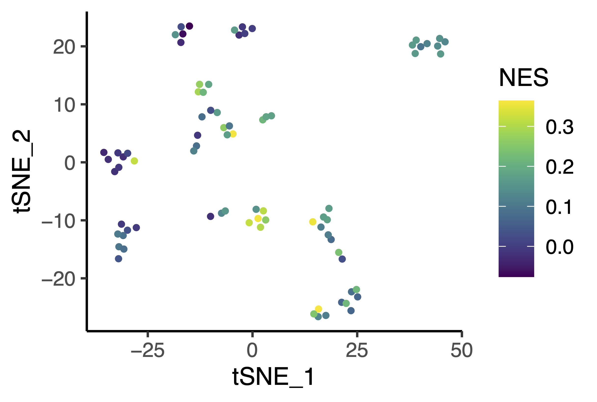
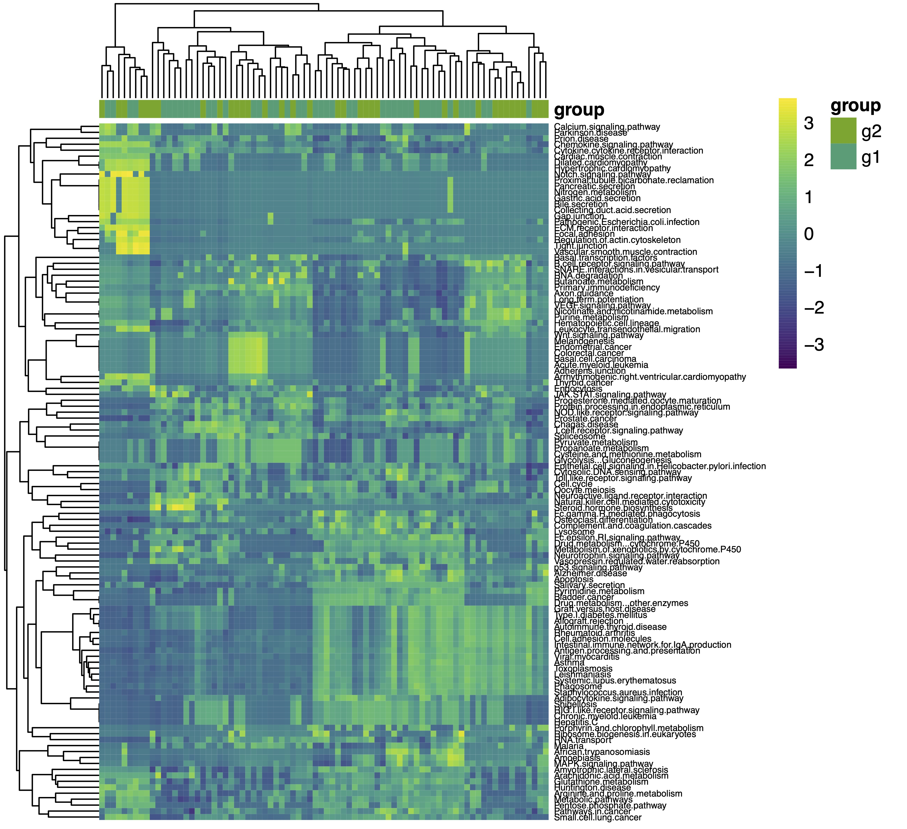

# scGSVA: GSVA for single-cell RNA seq analysis

[](http://www.repostatus.org/#active) [](https://github.com/guokai8/scGSVA) 

## Description

_scGSVA_ provides wrapper functions to perform GSVA, ssGSEA, PLAGE, z-score, and UCell enrichment analysis for single-cell RNA-seq data. The package includes a **custom C++ optimized implementation** of all four GSVA scoring methods (ssGSEA, GSVA, PLAGE, z-score) that produces identical results to the original GSVA Bioconductor package but runs significantly faster. It also includes functions to build gene set annotations for almost all species and generate publication-ready figures based on enrichment results.

### Key Features

- **Multiple enrichment methods**: ssGSEA, GSVA, PLAGE, z-score, and UCell scoring
- **C++ optimized**: Custom Rcpp implementation with up to 200x speedup over the original GSVA package
- **Parallel computing**: BiocParallel-based chunk parallelization for large datasets
- **Flexible annotation building**: Support for KEGG, GO, and MSigDB gene sets across 20+ species
- **Batch processing**: Efficient handling of large datasets with chunked computation
- **Rich visualization**: Violin plots, dot plots, ridge plots, heatmaps, feature plots, and spatial plots
- **Statistical testing**: Differential pathway analysis with limma, t-test, Wilcoxon, and ANOVA
- **Spatial transcriptomics**: Full support for Visium and other spatial platforms

## Installation

```r
library(devtools)
install_github("guokai8/scGSVA")

# For UCell support (optional)
BiocManager::install("UCell")
```

## Quick Start

```r
set.seed(123)
library(scGSVA)
data(pbmcs)

# Build annotation
hsko <- buildAnnot(species = "human", keytype = "SYMBOL", anntype = "KEGG")

# Run enrichment analysis (uses fast C++ implementation by default)
res <- scgsva(pbmcs, hsko, method = "ssgsea")

# Other methods: gsva, plage, zscore
res <- scgsva(pbmcs, hsko, method = "gsva")
res <- scgsva(pbmcs, hsko, method = "plage")
res <- scgsva(pbmcs, hsko, method = "zscore")

# Or use UCell (maxRank is auto-adjusted to fit gene set sizes)
res <- scgsva(pbmcs, hsko, method = "UCell")
```

## Visualization

### Violin Plot
```r
vlnPlot(res, features = "Wnt.signaling.pathway", group_by = "groups")

# Split violin plot (compare conditions within each cluster)
vlnPlot(res, features = "Wnt.signaling.pathway", group_by = "seurat_clusters",
        split.by = "groups", split.plot = TRUE)
```


### Dot Plot
```r
dotPlot(res, features = "Wnt.signaling.pathway", group_by = "groups")
```


### Ridge Plot
```r
ridgePlot(res, features = "Wnt.signaling.pathway", group_by = "groups")
```


### Feature Plot (UMAP/tSNE)
```r
featurePlot(res, features = "Wnt.signaling.pathway", reduction = "tsne")
```


### Heatmap
```r
Heatmap(res, group_by = "groups")
```


### Bar Plot
```r
barPlot(res, features = c("Wnt.signaling.pathway", "MAPK.signaling.pathway"),
        group_by = "groups")
```

### Lollipop Plot
```r
lollipopPlot(res, features = c("Wnt.signaling.pathway", "MAPK.signaling.pathway"),
             group_by = "groups")
```

## Statistical Analysis

### Differential Pathway Analysis
```r
# Linear model-based analysis (limma)
findPathway(res, group = "groups")

# Statistical tests (t-test, Wilcoxon, ANOVA)
sigPathway(res, group = "groups", test.use = "wilcox")
```

### Extract Pathway Genes
```r
# Get all genes in a pathway with expression values
genes(res, features = "Wnt.signaling.pathway")

# Get top influential genes driving pathway scores
topGenes(res, features = "Wnt.signaling.pathway", n = 10)

# With group-wise statistics
topGenes(res, features = "Wnt.signaling.pathway", n = 10, group = "groups")
```

### Summarize Pathways Across Groups
```r
# Get summary statistics for pathways
summaryPathway(res, features = c("Wnt.signaling.pathway", "MAPK.signaling.pathway"),
               group_by = "groups")
```

## Building Annotations

### KEGG/GO Annotations
```r
# KEGG pathways
hsko <- buildAnnot(species = "human", keytype = "SYMBOL", anntype = "KEGG")

# GO terms
hsgo <- buildAnnot(species = "human", keytype = "SYMBOL", anntype = "GO")

# Check supported species
showData()
```

### MSigDB Gene Sets
```r
# Hallmark gene sets
hallmark <- buildMSIGDB(species = "human", keytype = "SYMBOL",
                        anntype = "HALLMARK")

# KEGG pathways from MSigDB
msig_kegg <- buildMSIGDB(species = "human", keytype = "SYMBOL",
                         anntype = "KEGG")

# GO Biological Process
go_bp <- buildMSIGDB(species = "human", keytype = "SYMBOL",
                     anntype = "BP")

# Check available annotation types
msigdbinfo()
```

Available `anntype` values: HALLMARK, KEGG, REACTOME, BIOCARTA, GO, BP, CC, MF, CGP, MIR, TFT

### Offline Usage (China/Network Issues)

If you cannot connect to Zenodo, download the MSigDB file manually:

```r
# 1. Download manually (use VPN or mirror):
#    Human: https://zenodo.org/records/15800824/files/msigdb.2025.1.Hs.rds
#    Mouse: https://zenodo.org/records/15800824/files/msigdb.2025.1.Mm.rds

# 2. Load and use:
msig_data <- readRDS("msigdb.2025.1.Hs.rds")
hallmark <- buildMSIGDB(species = "human", keytype = "SYMBOL",
                        anntype = "HALLMARK", msigdb_data = msig_data)
```

## Spatial Transcriptomics

```r
library(Seurat)
library(SeuratData)

# Load spatial data
brain <- LoadData("stxBrain", type = "anterior1")

# Run enrichment
hsko <- buildAnnot(species = "human", keytype = "SYMBOL", anntype = "KEGG")
res <- scgsva(brain, hsko, assay = "Spatial")

# Visualize on tissue
spatialFeaturePlot(res, features = "Wnt.signaling.pathway")
```

## Performance

The custom C++ implementation produces **identical results** (correlation = 1.0, zero difference) to the original GSVA Bioconductor package, with significant speedups:

### Small Data (230 genes x 80 cells)

| Method | Custom (C++) | Original GSVA | Speedup |
|--------|-------------|---------------|----------|
| ssGSEA | 0.06s | 1.82s | **30x** |
| GSVA | 0.20s | 0.52s | **2.6x** |
| PLAGE | 0.01s | 2.27s | **162x** |
| z-score | 0.01s | 2.20s | **200x** |

### Big Data (2000 genes x 500 cells)

| Method | Custom (C++) | Original GSVA | Speedup |
|--------|-------------|---------------|----------|
| ssGSEA | 0.95s | 10.3s | **11x** |
| GSVA | 8.87s | 10.8s | **1.2x** |
| z-score | 0.09s | 2.87s | **34x** |

To compare with the original GSVA package implementation:

```r
# Default: fast custom C++ implementation
res <- scgsva(pbmcs, hsko, method = "ssgsea")

# Original GSVA package (for comparison/validation)
res_orig <- scgsva(pbmcs, hsko, method = "ssgsea", use.original = TRUE)
```

## Parameters

| Parameter | Description | Default |
|-----------|-------------|---------|
| `method` | Enrichment method: `"ssgsea"`, `"gsva"`, `"plage"`, `"zscore"`, `"UCell"` | `"ssgsea"` |
| `kcdf` | Kernel for CDF estimation (GSVA method): `"Poisson"` or `"Gaussian"` | `"Poisson"` |
| `mx.diff` | GSVA scoring: `TRUE` for max-min, `FALSE` for max deviation | `TRUE` |
| `abs.ranking` | Flag used with `mx.diff=TRUE` | `FALSE` |
| `ssgsea.norm` | Normalize ssGSEA scores | `TRUE` |
| `min.sz` / `max.sz` | Min/max gene set size filter | `1` / `Inf` |
| `batch` | Chunk size for batch processing | `1000` |
| `cores` | Number of parallel workers | `4` |
| `use.original` | Use original GSVA package instead of custom C++ | `FALSE` |
| `useTerm` | Use pathway names (`TRUE`) or IDs (`FALSE`) | `TRUE` |
| `maxRank` | Max genes to rank per cell (UCell only, auto-adjusted if needed) | `1500` |

## Note

The _scGSVA_ package includes a built-in C++ optimized implementation of all four GSVA scoring methods, with the original __GSVA__ Bioconductor package available as a fallback via `use.original=TRUE`. __UCell__ is optionally supported for UCell scoring. The package is under active development.

## Contact

For questions or issues, please contact guokai8@gmail.com or open an issue at https://github.com/guokai8/scGSVA/issues

## Recent Updates

- **Custom C++ implementation**: Built-in Rcpp-optimized ssGSEA, GSVA, PLAGE, z-score (up to 200x faster)
- **BiocParallel support**: Parallel kernel CDF computation for GSVA method on large datasets
- **`use.original` parameter**: Switch between custom C++ and original GSVA package for validation
- Added offline mode for `buildMSIGDB()` with `msigdb_data` parameter (for users in China)
- Added `topGenes()` function to extract influential genes per pathway
- Auto-adjusted `maxRank` for UCell method (prevents errors with large gene sets like KEGG)
- Added `barPlot()` and `lollipopPlot()` visualization functions
- Added `summaryPathway()` for pathway statistics across groups
- Fixed msigdbr compatibility (gs_collection/gs_subcollection)
- Improved batch processing for large datasets
- Added comprehensive tutorial vignette
